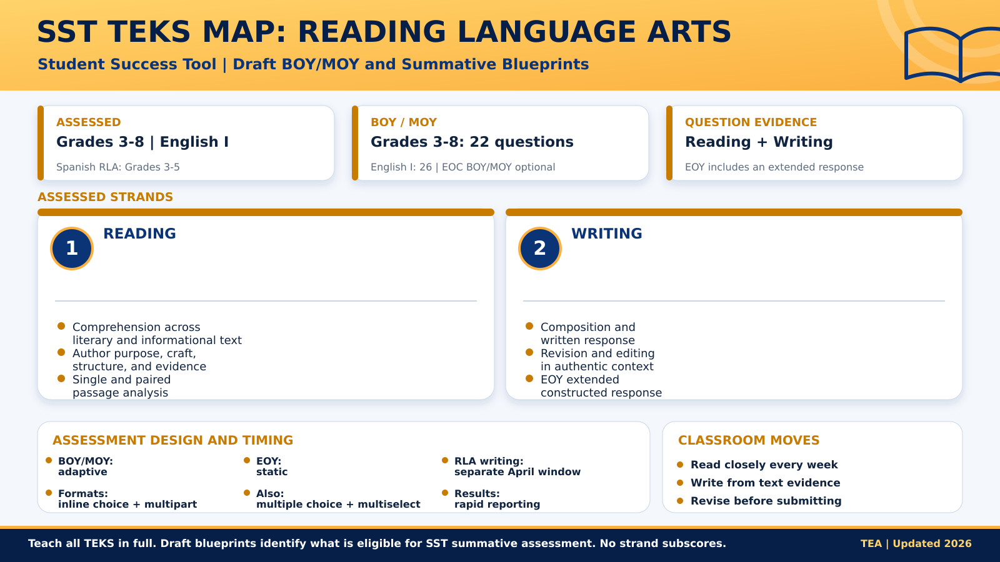
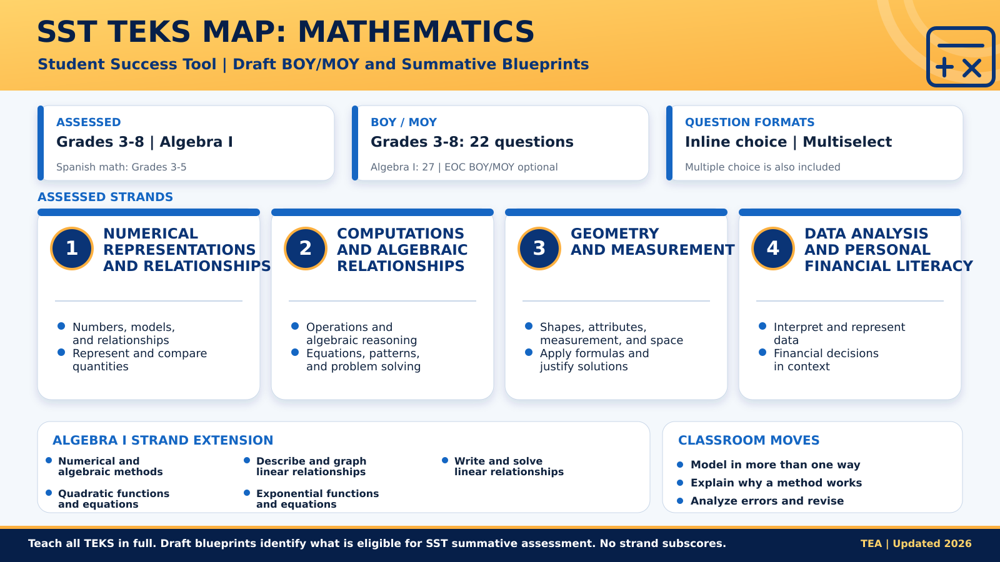
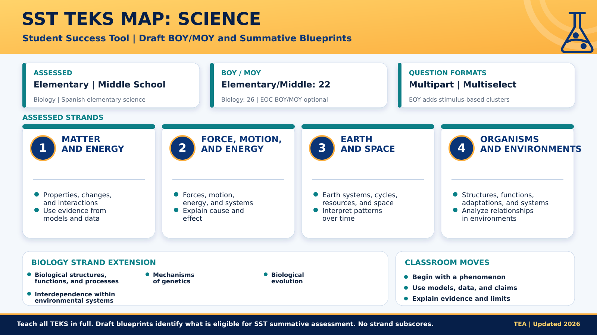
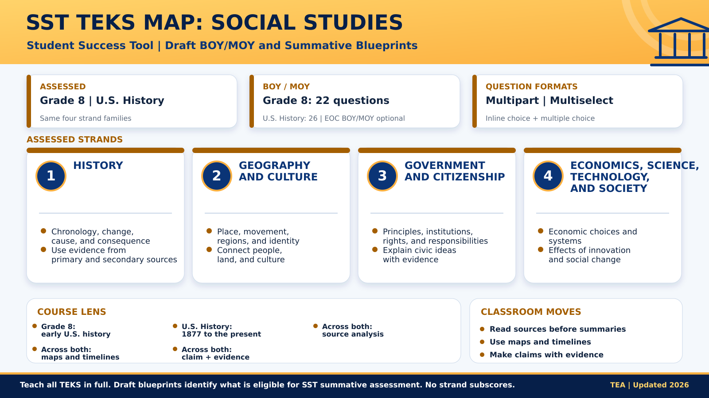

# From STAAR to SST: Four TEKS Maps for Texas Teachers

As you may already know, Texas is replacing STAAR with the Student Success Tool, or SST. You may be wondering, "What do I do now? Do I need to rebuild my class content?" This blog offers a timeline, and a plan. Come along.

## Get the Timeline Straight

STAAR remains in place during the 2026–2027 school year. Under House Bill 8, SST begins in 2027–2028 with beginning-of-year, middle-of-year, and end-of-year assessments. Grades three through eight will use all three checkpoints. BOY and MOY testing will be optional for Algebra I, Biology, English I, and U.S. History end-of-course assessments.

The BOY and MOY assessments will be adaptive. The EOY assessment will be static so its questions can be released. RLA writing will have a separate April window, followed by other EOY testing in May. TEA says results must reach school systems within two business days after the testing window closes. These details, along with current draft blueprints, appear on the [**TEA House Bill 8 Student Assessment page**](https://tea.texas.gov/data-reports/student-assessment-overview/house-bill-8-student-assessment).

One high school note matters: English II EOC will be eliminated beginning in 2027–2028, although students in the graduating classes of 2026 and 2027 still have the assessment as a graduation requirement.

## Read the Blueprints Without Shrinking the Curriculum

TEA places an important warning on each draft blueprint: all student expectations must still be taught in full. The blueprint identifies the TEKS eligible for the state summative assessment. It is a planning aid, not permission to skip everything that does not fit neatly inside one strand.

I would use these maps during lesson internalization and team planning. Start with the strand, connect it to the exact TEKS in your district curriculum, and decide what student evidence will show understanding.

## Reading Language Arts: Keep Reading and Writing Together

The RLA blueprints organize assessed TEKS into two reporting strands: reading and writing. BOY and MOY include inline choice, multipart, multiple-choice, and multiselect questions. The summative blueprint adds an extended constructed response. That makes regular reading, evidence-based responses, revision, and editing more useful than a late burst of isolated test practice. See the draft [Grade 3 RLA blueprint](https://tea.texas.gov/data-reports/staar/sst-3-rla-summative-blueprint.pdf) and [English I blueprint](https://tea.texas.gov/data-reports/staar/sst-english-i-summative-blueprint.pdf).

## Mathematics: Make Reasoning Visible

Across grades three through eight, the mathematics strands address numerical representations, computations and algebraic relationships, geometry and measurement, and data analysis with personal financial literacy. Algebra I adds strands for linear, quadratic, and exponential relationships. Use multiple representations, ask students to explain why a method works, and make error analysis routine. The [Grade 8 mathematics](https://tea.texas.gov/data-reports/staar/sst-8-math-summative-blueprint.pdf) and [Algebra I](https://tea.texas.gov/data-reports/staar/sst-algebra-i-summative-blueprint.pdf) blueprints show how those strands appear in the draft design.

## Science: Build Explanations from Evidence

Elementary and middle school science share four strand families: matter and energy; force, motion, and energy; Earth and space; and organisms and environments. Biology shifts to biological structures and processes, genetics, evolution, and environmental systems. The summative science blueprints also call for stimulus-based clusters. Students need practice interpreting models and data, then using that evidence to explain what is happening. Review the draft [elementary science](https://tea.texas.gov/data-reports/staar/sst-elementary-science-summative-blueprint.pdf), [middle school science](https://tea.texas.gov/data-reports/staar/sst-middle-school-science-summative-blueprint.pdf), and [Biology](https://tea.texas.gov/data-reports/staar/sst-biology-summative-blueprint.pdf) blueprints.

## Social Studies: Put Sources Before Summaries

Grade eight and U.S. History use the same four strand families: history; geography and culture; government and citizenship; and economics, science, technology, and society. Students should work regularly with maps, timelines, primary sources, and competing claims. A worksheet filled with disconnected dates will not build the source analysis these strands demand. Compare the draft [Grade 8 social studies](https://tea.texas.gov/data-reports/staar/sst-8-social-studies-summative-blueprint.pdf) and [U.S. History](https://tea.texas.gov/data-reports/staar/sst-us-history-summative-blueprint.pdf) blueprints.

## Turn Three Checkpoints into One Teaching Loop

| Checkpoint | Teacher move | Practical question |
|---|---|---|
| BOY | Identify unfinished learning and establish a baseline | What support does each student need first? |
| MOY | Regroup, reteach, and adjust scaffolds | What changed, and what is still getting in the way? |
| EOY | Review mastery, growth, and remaining gaps | What should the next teacher know? |

Your first move is small: bookmark the TEA page, download the blueprint for your grade or course, and bring one strand to your next planning meeting. Connect it to what students already produce in class. 

*Choose one assessed strand this week and add a short, visible check for student reasoning to an upcoming lesson.*
